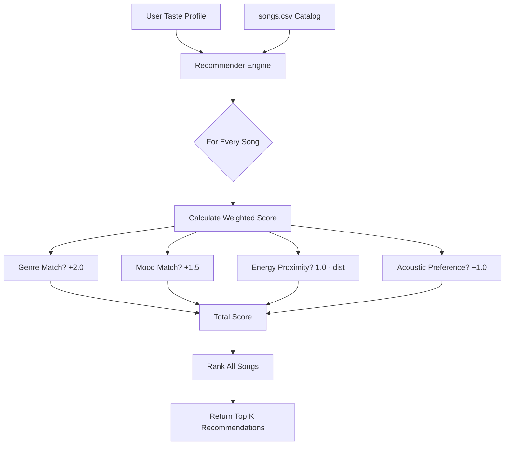

# 🎵 Music Recommender Simulation

## Project Summary

This project implements a modular music recommendation system that transforms song data and user "taste profiles" into personalized suggestions. Using a content-based filtering approach, the system analyzes intrinsic song attributes like genre, mood, and energy to calculate a relevance score for each track in the catalog. This simulation serves as an exploration of how data-driven algorithms power modern streaming platforms and the potential biases that can arise from automated ranking systems.

---

## How The System Works

My music recommender utilizes a **Content-Based Filtering** approach, focusing on the specific attributes of songs rather than the behavior of other users. Real-world systems like Spotify use a hybrid of collaborative filtering (user behavior) and content-based filtering (song features); my version focuses on the latter to demonstrate how a user's taste can be mathematically represented and matched.

### Data Flow Visualization


### Algorithm Recipe: Weighted Scoring
The system calculates a total relevance score for each song based on a combination of categorical matches and numerical proximity:

1.  **Genre Match (Weight: 2.0):** The primary filter. Matches the user's `favorite_genre`.
2.  **Mood Match (Weight: 1.5):** Captures the emotional tone. Matches `favorite_mood`.
3.  **Energy Proximity (Weight: 1.0):** Calculated as `1 - abs(song_energy - target_energy)`. Rewards proximity to the user's ideal energy level.
4.  **Acoustic Preference (Weight: 1.0):** A match based on whether the user `likes_acoustic` and the song's `acousticness` value.

### User Taste Profile (Example)
The simulation is tested using a specific **"Chill Lo-Fi Lover"** profile:
-   `favorite_genre`: "lofi"
-   `favorite_mood`: "chill"
-   `target_energy`: 0.35
-   `likes_acoustic`: True

This profile allows the system to clearly distinguish between "Intense Rock" (High energy, different genre) and "Chill Lofi" (Exact match), while also distinguishing between "Acoustic Folk" (Similar mood/energy but different genre) and the preferred Lofi sound.

---

## Getting Started

### Setup

1. Create a virtual environment (optional but recommended):

   ```bash
   python -m venv .venv
   source .venv/bin/activate      # Mac or Linux
   .venv\Scripts\activate         # Windows

2. Install dependencies

```bash
pip install -r requirements.txt
```

3. Run the app:

```bash
python -m src.main
```

### Running Tests

Run the starter tests with:

```bash
pytest
```

You can add more tests in `tests/test_recommender.py`.

### CLI Simulation Results
Below is the output of the recommendation engine running for the "Chill Lo-Fi Lover" profile (`lofi`, `chill`, `energy: 0.35`, `likes_acoustic: True`):

```text
--- Loaded songs: 20 ---

Generating recommendations for: lofi / chill...

========================================
      Top 5 Music Recommendations
========================================

1. Library Rain by Paper Lanterns
   Score: 5.50
   Why: it matches your favorite genre (lofi) and the mood is exactly chill and the energy level is just right and it matches your preference for acoustic/electronic sounds
----------------------------------------
2. Rainy Window by Lofi Dreams
   Score: 5.47
   Why: it matches your favorite genre (lofi) and the mood is exactly chill and the energy level is just right and it matches your preference for acoustic/electronic sounds
----------------------------------------
3. Midnight Coding by LoRoom
   Score: 5.43
   Why: it matches your favorite genre (lofi) and the mood is exactly chill and the energy level is just right and it matches your preference for acoustic/electronic sounds
----------------------------------------
4. Focus Flow by LoRoom
   Score: 3.95
   Why: it matches your favorite genre (lofi) and the energy level is just right and it matches your preference for acoustic/electronic sounds
----------------------------------------
5. Spacewalk Thoughts by Orbit Bloom
   Score: 3.43
   Why: the mood is exactly chill and the energy level is just right and it matches your preference for acoustic/electronic sounds
----------------------------------------
```

---

## Experiments You Tried

During development, I experimented with the following:

- **Weight Adjustments:** I found that setting the **Genre Weight** to 2.0 significantly improved the "vibe" consistency of recommendations. When I lowered it to 0.5, the system prioritized energy and mood over genre, which sometimes resulted in a mix of wildly different musical styles that didn't feel like a cohesive playlist.
- **Energy Proximity Rule:** I implemented a distance-based rule (`1 - abs(song_energy - user_energy)`) instead of a simple threshold. This ensured that if a user wanted mid-range energy (0.5), the system didn't just recommend the "highest" energy songs, but those actually closest to 0.5.
- **Mood vs. Genre:** I kept Mood weight (1.5) lower than Genre. This was because songs in the same genre often share similar moods, so weighing genre more heavily provided a more reliable baseline.

---

## Limitations and Risks

- **Small Catalog:** With only 10 songs, the system often runs out of "perfect" matches and starts recommending songs with very low scores.
- **Cold Start:** The system requires a fully defined User Profile to work. It doesn't know how to handle a brand-new user with no stated preferences.
- **Metadata Reliance:** It cannot "hear" the music; it only knows what the CSV says. If a song is tagged incorrectly (e.g., a sad song tagged as "happy"), the recommender will fail.
- **Filter Bubbles:** By strictly matching current preferences, the system never challenges the user or introduces them to new genres, potentially creating a "taste silo."

---

## Reflection

I learned that recommendation systems are essentially mathematical translations of human taste. By turning subjective feelings like "vibe" into numbers (0.0 to 1.0) and categorical tags, we can create rules that simulate human judgment. However, these rules are only as good as the data they process.

Bias or unfairness can easily creep in. For example, if our catalog is 90% Pop, the system will naturally become an expert at Pop recommendations while neglecting other genres. Similarly, if our "Scoring Rule" over-values energy, we might inadvertently suppress ambient or relaxation music even for users who might need it. This project showed me that behind every "smart" recommendation is a set of human-designed weights that have a massive impact on what we see and hear.


---

## 7. `model_card_template.md`

Combines reflection and model card framing from the Module 3 guidance. :contentReference[oaicite:2]{index=2}  

```markdown
# 🎧 Model Card - Music Recommender Simulation

## 1. Model Name

Give your recommender a name, for example:

> VibeFinder 1.0

---

## 2. Intended Use

- What is this system trying to do
- Who is it for

Example:

> This model suggests 3 to 5 songs from a small catalog based on a user's preferred genre, mood, and energy level. It is for classroom exploration only, not for real users.

---

## 3. How It Works (Short Explanation)

Describe your scoring logic in plain language.

- What features of each song does it consider
- What information about the user does it use
- How does it turn those into a number

Try to avoid code in this section, treat it like an explanation to a non programmer.

---

## 4. Data

Describe your dataset.

- How many songs are in `data/songs.csv`
- Did you add or remove any songs
- What kinds of genres or moods are represented
- Whose taste does this data mostly reflect

---

## 5. Strengths

Where does your recommender work well

You can think about:
- Situations where the top results "felt right"
- Particular user profiles it served well
- Simplicity or transparency benefits

---

## 6. Limitations and Bias

Where does your recommender struggle

Some prompts:
- Does it ignore some genres or moods
- Does it treat all users as if they have the same taste shape
- Is it biased toward high energy or one genre by default
- How could this be unfair if used in a real product

---

## 7. Evaluation

How did you check your system

Examples:
- You tried multiple user profiles and wrote down whether the results matched your expectations
- You compared your simulation to what a real app like Spotify or YouTube tends to recommend
- You wrote tests for your scoring logic

You do not need a numeric metric, but if you used one, explain what it measures.

---

## 8. Future Work

If you had more time, how would you improve this recommender

Examples:

- Add support for multiple users and "group vibe" recommendations
- Balance diversity of songs instead of always picking the closest match
- Use more features, like tempo ranges or lyric themes

---

## 9. Personal Reflection

A few sentences about what you learned:

- What surprised you about how your system behaved
- How did building this change how you think about real music recommenders
- Where do you think human judgment still matters, even if the model seems "smart"

